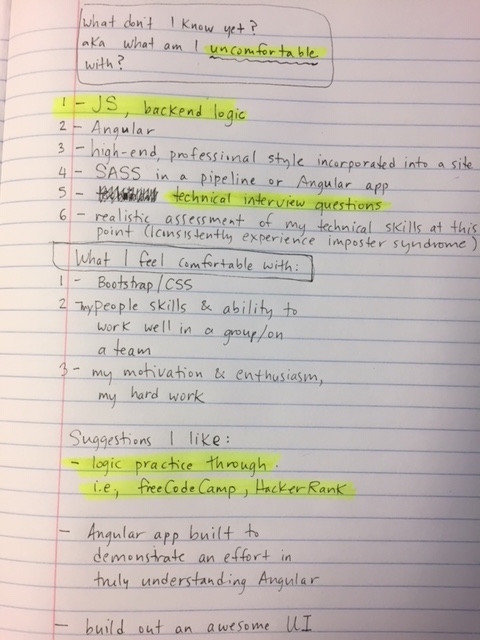
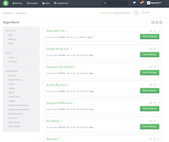
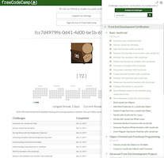
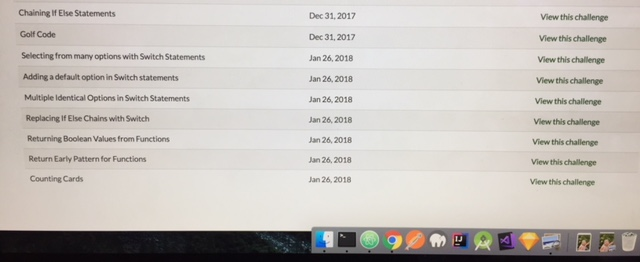

## Javascript Week 4 Solo Project: Free Choice

## Backend Logic Practice

#### January 26, 2018

### Cat Janowitz

###  Description
Step1: Create a list that summarizes my strengths and weaknesses in coding, including technical and non-technical aspects:

Step2: Focus on an area of improvement: Javascript logic. Document problem-solving via a series of online practice problems offered through freeCodeCamp and HackerRank

  

(JUST SIGNED UP TO HACKER RANK)

Problems solved via freeCodeCamp as of 11:59am:

Stuck on this problem for over an hour (with only one last objective):

Tried HackerRank problems:

###  Questions to Consider:

* What do I want to prioritize to prep for the coming weeks, as well as after Epicodus?

I want to work through Javascript-based problems to improve my understanding of the language and to prepare for technical interviews. As of now my confidence is lower than I'd like in my problem-solving skills. Areas I can greatly improve in are solving JS problems that includes using technical language to describe the process. Fundamental understanding of Javascript is key to my future in coding since it's a powerful and ubiquitous tool in development.

My next priority would be to strengthen my design skills.  There are a few Epicodus-based projects I've created that I feel good about but I want to work toward making sites that are stunning to look at. I tend to like clean, simple formats. This is where my focus would start, utilizing Bootstrap, exploring Materialize, getting more comfortable with Flexbox and CSS Grid.  That said, I'd also want to improve my non-framework design skills since Flexbox/Grid support is still far from universal.

UPDATE: just had a discussion at lunch with a fellow Epicodus student (Kyle, Java track). He re-iterated what I've heard before regarding the value of learning AWS. At lunch I signed up with acloud.guru to explore AWS tutorials.

Copyright (c) 2018 **Cat Janowitz**
